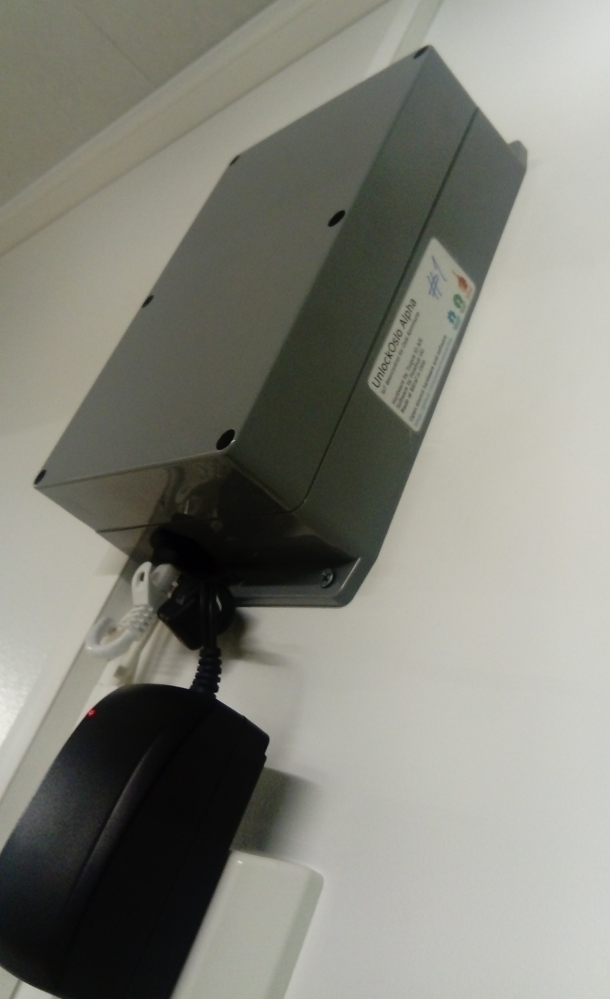
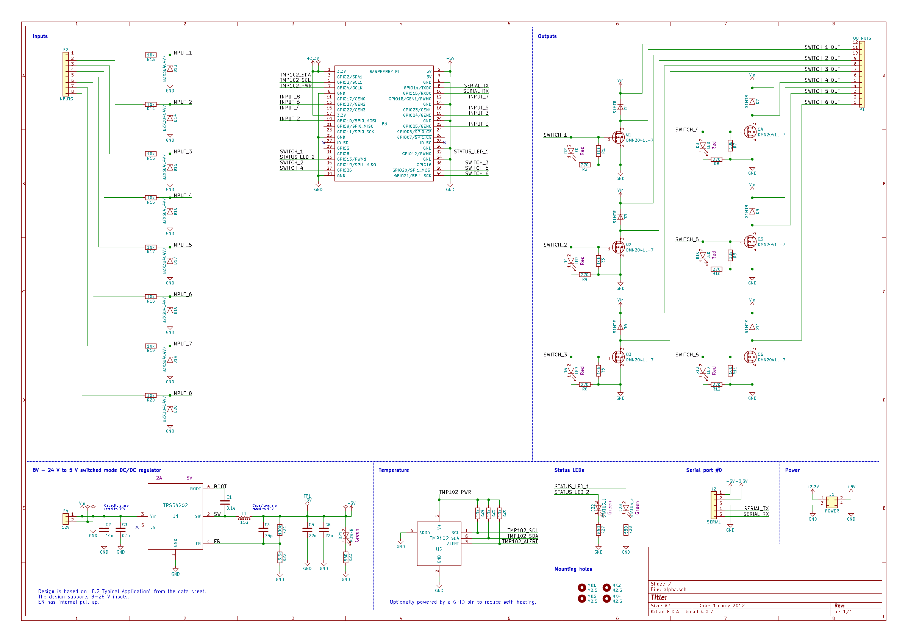
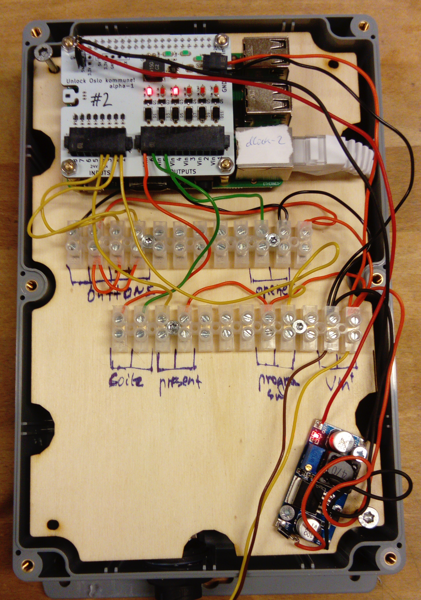

# Bill of materials

* RPi,enclosure etc. [Digikey BOM](./assembly.csv)
* UnlockOslo RPi hat. [Digikey BOM](./alpha-1/production/) 
* wiring
* Ethernet cable

# Enclosure

3d-model. [FreeCAD source](./enclosure.fcstd)

# UnlockOslo Hat "alpha"

The "alpha" board is a Hat for Raspberry Pi boards. Main features:

* Step down converter to 5 V, 2 A. This is enough to power the
  Raspberry Pi board.
* 8 inputs, supports up to 24 V inputs.
* 6 outputs, the output voltage is the same as input voltage. LEDs
  indicate the pin's status.
* On-board temperature sensor.
* Two status LEDs, controlled by GPIO.
* The serial port is broken out on its own header. Useful for
  low-level rpi debugging.
* 5 V and 3 V rails are broken out to a separate power header. The 3 V
  rail is from the rpi regulator.

## alpha-3

Improved version of alpha-1. Fixed bugs, added reverse polarity
protection. Produced by PCBway, assembled at Bitraf.

[KiCad project](./alpha-1)

## alpha-2

An experiment into if it was possible to include an esp8266 on the
board while keeping it RPi hat compatible. Conclusion: Almost
possible.

## alpha-1

Original version. Deployed at two locations.

[KiCad project](./alpha-1)

All components available from Digikey.

The PCB has been successfully produced by PCBWay, and assembled at Bitraf.

# Wiring

[KiCad project](./connections)

