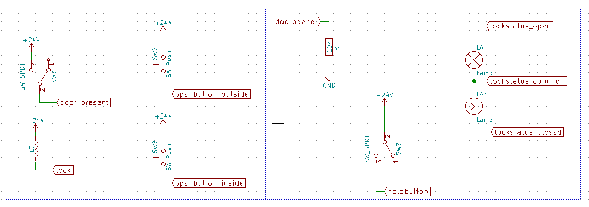

## Bill of materials

* Raspberry PI3. `digikey 1690-1000-ND`
* Enclosure. `digikey 377-1904-ND`
* Ethernet connector. `digikey APC1766-ND`
* Ethernet cable 0.5m, UTP CAT6. `kjell.com  `
* Powersupply, 24VDC. `kjell.com  `
* UnlockOslo shield...

## UnlockOslo Alpha-1 Shield

[KiCad project](./alpha-1)

All components available from Digikey.

The PCB has been successfully produced by PCBWay, and assembled at Bitraf.

## Enclosure

3d-model. [FreeCAD source](./enclosure.fcstd)

## Wiring

[KiCad project](./connections)

